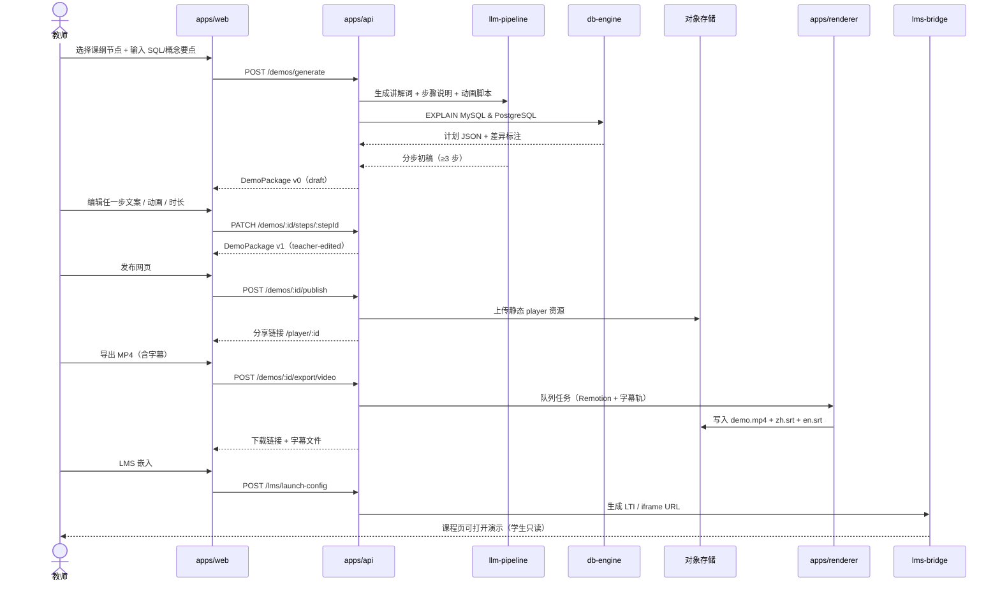
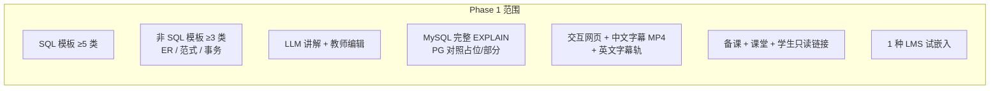
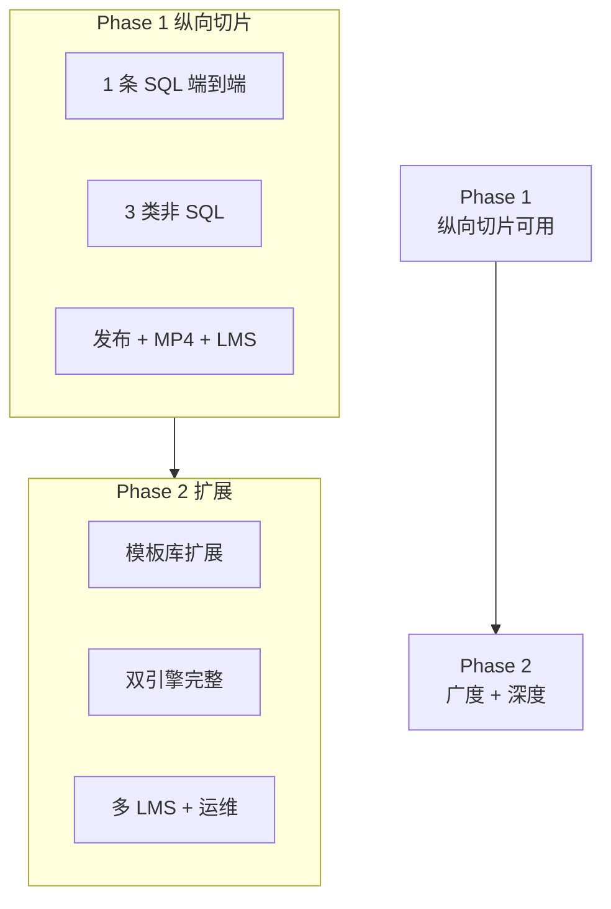
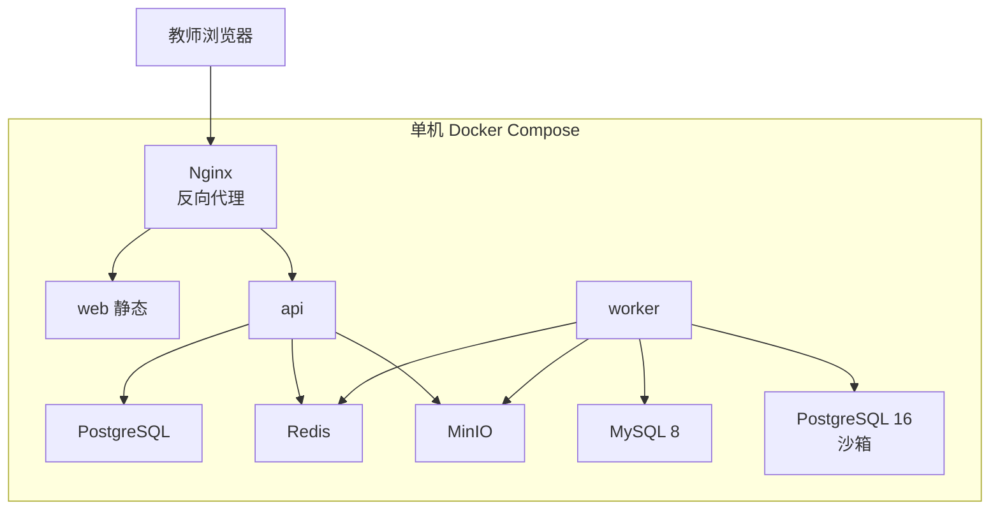

# 数据库课程演示视频生成工具 — 架构设计

| 字段 | 值 |
|---|---|
| **日期** | 2026-06-01 |
| **状态** | 架构初稿，待 PoC 验证 |
| **项目代号** | db_demo_video |
| **需求来源** | [db_demo_video_requirements.md](./db_demo_video_requirements.md) |
| **建议代码根目录** | `02_DB_Demo_Studio/`（本仓库新建 monorepo） |

---

## 背景与目标

### 背景

大学数据库课程教师需要将课本中抽象概念（SQL 执行、ER 建模、范式、事务、索引、存储恢复等）转化为**可逐步展示**的可视化演示。现有工具要么偏「纯视频、不可编辑」，要么偏「交互网页、无 MP4 导出」，且普遍缺乏 **MySQL / PostgreSQL 执行计划对照** 与 **LMS 嵌入** 能力。

### 产品目标

构建面向真实课堂的 **DB Demo Studio**（工作名）：教师从课纲节点出发，经 **LLM 自动生成讲解词与分步动画初稿**，精修后**同源发布**交互网页与带双语字幕 MP4，并嵌入 Moodle / 超星等 LMS。学生可在课后通过 LMS 或分享链接进行只读自学。

### 架构目标

| 目标 | 说明 |
|---|---|
| **单一真相源** | 一份「演示包（Demo Package）」驱动网页播放与 MP4 导出，避免双维护 |
| **人机协作** | LLM 生成 → 教师编辑 → 定稿，保留 AI 初稿与教师定稿版本 |
| **双引擎 fidelity** | SQL 步骤语义对齐 MySQL + PostgreSQL `EXPLAIN`，不一致处显式标注「教学简化」 |
| **三场景 UX** | 备课工作台、课堂演示模式、学生自学只读模式，共享同一渲染内核 |
| **可观测成本** | LLM / TTS / 渲染任务可审计、可降级、教师可见预估 |
| **渐进交付** | Phase 1 可进课堂试用；Phase 2 补齐全课纲深度与 LMS 生产级 |

### 非目标（YAGNI）

- 不自建 DBMS 或内核级 Buffer Pool / WAL 仿真
- 不做完整非线性剪辑台、不替代 LMS 本身
- Phase 1 不做全校 SSO 全覆盖、不做 LMS 成绩簿深度回写

---

## 技术栈

| 层级 | 推荐选型 | 职责 |
|---|---|---|
| **前端（Web App）** | React 18 + TypeScript + Vite | 备课编辑、课堂播放器、学生只读页 |
| **UI / 动画** | Tailwind CSS + Framer Motion + React Flow | 步骤动画、ER 图、执行计划树、B+ 树示意 |
| **后端 API** | Node.js + Fastify（或 NestJS） | 认证、演示 CRUD、任务编排、LMS 回调 |
| **任务队列** | BullMQ + Redis | LLM 生成、EXPLAIN 采集、MP4 渲染异步化 |
| **主数据库** | PostgreSQL 16 | 用户、演示包、版本、任务、审计日志 |
| **对象存储** | MinIO（开发）/ S3 兼容（生产） | MP4、字幕、离线包、静态资源 |
| **LLM** | OpenAI GPT-4o / Azure OpenAI（校内可切换国产 API） | 讲解词、步骤说明、动画脚本建议 |
| **TTS** | Azure Speech / 火山引擎（Phase 1 可选） | 旁白音轨；Phase 1 以字幕为主 |
| **视频导出** | Remotion + `@remotion/renderer` + ffmpeg | 由演示包时间轴渲染 MP4；烧录/软字幕 |
| **SQL 解析** | `node-sql-parser`（初稿）+ 引擎原生 `EXPLAIN` | 语法树与真实计划对照 |
| **DB 引擎集成** | Docker：MySQL 8.0 + PostgreSQL 16 | 隔离沙箱执行 `EXPLAIN`，禁止 DDL/DML 写操作 |
| **字幕 / i18n** | 自研时间轴 + `i18next` | 中英双语文案；导出 SRT / VTT / 内嵌字幕 |
| **LMS** | **LTI 1.3**（Moodle 主路径）+ iframe 深链接（超星备选） | 课程上下文、只读嵌入 |
| **部署** | Docker Compose（开发/PoC）→ 单机或 K8s（生产）；支持校内私有化 | Web 为主 + 可选离线静态包 |

### 模板三行摘要（对齐 workflow kit）

- **技术栈：** TypeScript monorepo — React/Vite 前端 + Fastify 后端 + Remotion 渲染 + PostgreSQL/Redis/MinIO；LLM/TTS 付费 API；Docker 沙箱 MySQL 8 + PostgreSQL 16
- **相关模块：** `02_DB_Demo_Studio/apps/web`、`apps/api`、`apps/renderer`、`packages/demo-schema`、`packages/db-engine`、`packages/llm-pipeline`、`packages/lms-bridge`
- **约束：** 60s 内生成初稿；网页与 MP4 步骤一致；敏感 SQL 默认不出境；所有引擎差异须标注教学简化；Phase 1 至少 1 种 LMS 试嵌入

---


## 相关模块与建议目录结构

新建 monorepo：`02_DB_Demo_Studio/`（pnpm workspace + Turborepo）

```
02_DB_Demo_Studio/
├── apps/
│   ├── web/                    # React 前端：备课 / 课堂 / 学生三模式
│   │   ├── src/
│   │   │   ├── pages/          # prep/, live/, study/, editor/
│   │   │   ├── features/       # step-editor, curriculum-picker, export-panel
│   │   │   └── player/         # 统一步骤播放器（三模式共用）
│   ├── api/                    # Fastify REST + WebSocket（课堂同步可选）
│   │   └── src/
│   │       ├── routes/         # demos, generate, export, lms, auth
│   │       ├── workers/        # BullMQ job handlers
│   │       └── services/
│   └── renderer/               # Remotion 项目 + CLI 渲染入口
│       └── src/
│           ├── compositions/   # DemoVideoComposition
│           └── render-cli.ts
├── packages/
│   ├── demo-schema/            # 演示包 JSON Schema + Zod 校验 + 版本迁移
│   ├── viz-primitives/         # 共享可视化：PlanTree, ERDiagram, BPlusTree, TransactionTimeline
│   ├── db-engine/              # MySQL/PG 连接池、EXPLAIN 解析、教学简化标注
│   ├── sql-analyzer/           # SQL 解析、步骤拆分、错误定位
│   ├── llm-pipeline/           # 提示词模板、课纲上下文注入、流式生成、降级
│   ├── subtitle-kit/           # 时间轴、双语 SRT/VTT、与步骤对齐校验
│   ├── lms-bridge/             # LTI 1.3 launch、超星 embed URL 生成
│   ├── curriculum/             # 课纲节点、章节模板注册表（Phase 1/2 标记）
│   └── ui-kit/                 # 设计系统、教学简化 Badge、步骤控件
├── infra/
│   ├── docker-compose.yml      # api + web + postgres + redis + minio + mysql + pg
│   ├── docker-compose.offline.yml
│   └── k8s/                    # Phase 2 校内私有化清单
├── docs/
│   ├── curriculum-mapping.md   # 课纲—模板映射表（下一步产出）
│   └── lms-setup-moodle.md
├── package.json
└── turbo.json
```

### 与现有仓库关系

| 路径 | 关系 |
|---|---|
| `00_Notes/requirements/` | 需求与架构文档（本文件） |
| `01_AI_Dev_Workflow_Kit/` | 可复用 Docker / prompt 工作流经验；**不**直接耦合运行时 |
| `02_DB_Demo_Studio/` | **新建**独立产品代码根目录 |

---

## 核心数据流

### 端到端：备课 → 编辑 → 发布网页 → 导出 MP4 → LMS



### 演示包（Demo Package）— 单一真相源

所有出口均读取同一份 JSON 文档（`packages/demo-schema`）：

```typescript
// 概念结构（非最终实现）
interface DemoPackage {
  id: string;
  curriculumNodeId: string;       // 课纲节点
  templateType: 'sql-explain' | 'er-model' | 'normalization' | 'transaction' | 'bplus-tree' | 'storage-recovery' | 'concept-generic';
  title: { zh: string; en: string };
  steps: DemoStep[];
  engineCompare?: { mysql?: ExplainSnapshot; postgres?: ExplainSnapshot; simplificationNotes?: string[] };
  metadata: { aiDraftVersion?: string; teacherVersion: number; publishedAt?: string };
  playback: { defaultStepDurationMs: number; subtitles: SubtitleTrack[] };
}

interface DemoStep {
  id: string;
  order: number;
  narration: { zh: string; en: string; source: 'ai' | 'teacher' };
  visuals: VisualSpec;            // 引用 viz-primitives 类型
  timing: { durationMs: number; pauseAfterMs?: number };
}
```

**关键原则：** 网页 Player 与 Remotion Composition **共用** `viz-primitives` 与 `demo-schema`，保证步骤、文案、时长一致。

---

## 模块职责说明

| 模块 | 路径 | 职责 |
|---|---|---|
| **Web App** | `apps/web` | 三场景路由；课纲选择；步骤编辑器；导出面板；课堂键盘快捷键（空格暂停、←/→ 步进） |
| **API 服务** | `apps/api` | REST API；JWT / 校内 OIDC；演示 CRUD；生成/导出任务入队；RBAC（教师 vs 学生只读） |
| **Renderer** | `apps/renderer` | 读取 DemoPackage → Remotion 时间轴 → MP4；ffmpeg 字幕烧录 |
| **demo-schema** | `packages/demo-schema` | Schema 定义、校验、v0→v1 迁移；导出前一致性检查 |
| **viz-primitives** | `packages/viz-primitives` | SQL 计划树、表/索引、ER、B+ 树、事务时间线；标注「教学简化」Badge |
| **db-engine** | `packages/db-engine` | 沙箱连接；`EXPLAIN FORMAT=JSON`；结果归一化为统一 IR；MySQL/PG diff |
| **sql-analyzer** | `packages/sql-analyzer` | 词法/语法解析；错误定位；步骤候选（解析→优化→计划→执行→结果） |
| **llm-pipeline** | `packages/llm-pipeline` | 课纲-aware 提示词；结构化 JSON 输出；失败重试；手写文案降级 |
| **subtitle-kit** | `packages/subtitle-kit` | 步骤时间轴→字幕段；中英互译（LLM 可选）；导出 SRT/VTT；同步校验 |
| **lms-bridge** | `packages/lms-bridge` | LTI 1.3 OIDC login + deep link；超星 iframe URL；embed CSP 指南 |
| **curriculum** | `packages/curriculum` | 8 大类课纲模板注册；Phase 1/2 实现标记；教材章节映射 |

---

## 约束

### 性能

| 约束 | 指标 / 策略 |
|---|---|
| 生成初稿 | 合法 SQL + 课纲输入 → **60 秒内**返回 ≥3 步初稿（含 LLM，异步流式可先展示部分步骤） |
| 课堂播放 | 步骤切换 **< 200ms**（预加载下一步 visual）；弱网提供离线包 |
| MP4 导出 | 5 分钟演示 **< 10 分钟**渲染（720p 默认）；失败不阻塞网页发布 |
| 并发 | Phase 1 目标 **≤ 50** 并发课堂会话；渲染队列限流 |

### 兼容性与环境

| 约束 | 说明 |
|---|---|
| 浏览器 | Chrome / Edge / Firefox 最近两个 major；课堂模式全屏 1920×1080 |
| 数据库 | MySQL 8.0.x、PostgreSQL 16.x（Docker 固定小版本） |
| LMS | Moodle 4.x（LTI 1.3）；超星（iframe + 链接，Phase 1 二选一深度试通） |
| 离线 | Phase 1 支持「预下载静态包」（HTML + JS + 可选 MP4 + 字幕） |

### 安全与合规

| 约束 | 说明 |
|---|---|
| 数据出境 | 默认 LLM 走**可配置端点**；含敏感 SQL/数据的请求**默认禁止**发往未授权第三方；审计日志记录每次外呼 |
| 沙箱 | DB 引擎容器：**只读**账号；禁止 DDL/DML；超时 5s；网络隔离 |
| 权限 | 学生链接 **只读**；编辑需教师角色；分享链接可设过期 |
| 付费 API | 教师可见单次生成预估；配额可设；API Key 仅存服务端 |

### 教学简化（Disclaimer）

- 所有非引擎原生行为（动画示意、合并步骤、理想化 B+ 树）必须渲染 **「教学简化」** 可见标识
- MySQL 与 PostgreSQL 计划不一致时：**并排或 Tab** 展示 + 文字说明差异原因
- UI 发布前若仍为 AI 初稿未编辑，提示「建议校对 AI 生成讲解与动画」

### 双语字幕

- Phase 1：**字幕级**中英双语（双 SRT 轨或双语 VTT）；网页 Player 可切换显示语言
- 文案源：`narration.zh` / `narration.en` 同步维护；导出前 **时间轴对齐校验**
- Phase 2：可选双 TTS 音轨

---

## 技术选型对比

### 1. 整体架构：Monorepo（推荐） vs 多仓库

| 维度 | **A：pnpm Monorepo（推荐）** | B：前后端 + 渲染分仓 |
|---|---|---|
| 复杂度 | 中 — Turborepo 统一构建 | 高 — 三仓版本对齐 |
| 双交付一致性 | **高** — 共享 `demo-schema` + `viz-primitives` | 低 — 易出现网页/视频漂移 |
| 维护成本 | 低 — 单 PR 改 schema + UI + 渲染 | 高 |
| 风险 | 仓库体积随 Remotion 增大 | 集成测试困难 |
| **结论** | **推荐 A** | 仅当多团队独立运维时考虑 |

### 2. 视频导出：Remotion（推荐） vs Puppeteer 录屏

| 维度 | **A：Remotion** | B：Puppeteer 录屏 |
|---|---|---|
| 质量 | **高** — 矢量动画、确定性帧 | 中 — 依赖 GPU/字体/分辨率 |
| 字幕 | 时间轴原生对齐 | 需后期 ffmpeg 对齐，易漂移 |
| 复杂度 | 中 — 与 React 共享组件 | 低 — 启动快 |
| CI 渲染 | 成熟（Lambda/本地） | 不稳定 |
| **结论** | **推荐 A**（与 viz-primitives 共用） | Phase 0 极早 PoC 可试 B，不进入生产 |

### 3. 后端运行时：Node Fastify（推荐） vs Python FastAPI

| 维度 | **A：Node + Fastify** | B：Python FastAPI |
|---|---|---|
| 与 Remotion 集成 | **原生同栈** | 跨语言任务传递 |
| SQL 生态 | node-sql-parser + 子进程 EXPLAIN | sqlparse + psycopg2 成熟 |
| 团队 TS 统一 | **是** | 需维护两套类型 |
| AI 生态 | 够用 | LangChain 更丰富 |
| **结论** | **推荐 A** | LLM 编排极复杂时可抽 `llm-pipeline` 为 Python sidecar（YAGNI，Phase 2 再评估） |

### 4. LMS 集成：LTI 1.3（推荐） vs 仅 iframe 链接

| 维度 | **A：LTI 1.3 主 + iframe 备** | B：仅 iframe / 深链接 |
| Moodle | **原生支持** | 可用但无课程上下文 |
| 超星 | 深链接 + iframe；LTI 视学校开通 | **仅链接** |
| 身份 | 可传递 role（Instructor/Learner） | 难区分师生 |
| 实施 | 中 — OIDC + JWKS | 低 |
| **结论** | **Moodle 走 LTI 1.3**；超星 Phase 1 用 **签名链接 + iframe** | 作为 fallback |

### 5. LLM：Azure OpenAI（推荐） vs 国产 API（备选）

| 维度 | **A：Azure OpenAI** | B：通义 / 文心 / DeepSeek |
|---|---|---|
| 合规 | 校方易采购、数据区域可控 | 国内部署友好 |
| 结构化输出 | **强** | 因模型而异 |
| 成本 | 中 | 低 |
| **结论** | 有 Azure 教育协议时 **推荐 A** | 无境外合规顾虑时用 B；通过 `llm-pipeline` 抽象切换 |

### 6. 双引擎 EXPLAIN：Docker 沙箱（推荐） vs 解析器模拟

| 维度 | **A：真实引擎 EXPLAIN** | B：纯解析器模拟计划 |
|---|---|---|
| Fidelity | **高** — 对齐 Q4 | 低 — 易偏离真实 |
| 安全 | 容器隔离 + 只读 | 无 DB 风险 |
| 运维 | 需 MySQL/PG 容器 | 低 |
| **结论** | **推荐 A**；B 仅作离线演示 fallback | |

---

## Phase 1 MVP 架构 vs Phase 2

### Phase 1（可进课堂试用）



| 能力 | Phase 1 实现要点 |
|---|---|
| 演示包 | `demo-schema` v1；步骤编辑 + 版本保存 |
| 生成 | LLM 结构化输出 + `db-engine` MySQL 完整；PG 至少 1 类 SQL 可对照 |
| 可视化 | PlanTree + ER + 基础范式/事务时间线 |
| 导出 | Remotion 720p + zh/en SRT；网页优先，MP4 异步 |
| LMS | Moodle LTI 1.3 **或** 超星 iframe（二选一深度 PoC） |
| 降级 | LLM/TTS/渲染失败时保留已编辑网页；支持纯手写文案 |
| 案例库 | 基础保存/复用（F16 简版） |

### Phase 2（教学产品完善）

| 能力 | Phase 2 增量 |
|---|---|
| 课纲 | 8 大类模板 **100%**；B+ 树、存储恢复、锁深度动画 |
| 双引擎 | MySQL **与** PostgreSQL **完整**并排/切换 |
| 双语 | 双语 TTS 音轨、字幕编辑器、多格式导出 |
| LMS | Moodle + 超星双验；可选 xAPI 学习记录 |
| 学生 | 进度追踪、章节导航、LMS 成绩簿可选对接 |
| 运维 | 校内私有化 K8s、备份、合规审计、API 成本报表 |
| 离线 | 一键离线包；弱网课堂优化 |

### 架构演进示意



---

## 风险与缓解

| 风险 | 影响 | 缓解措施 |
|---|---|---|
| LLM 讲解词不准确 | 教学误导 | 教师必可编辑；AI/定稿对比；发布前校对提示 |
| 网页与 MP4 不同步 | 验收失败 | 单一 DemoPackage + 共享 viz；导出前自动 diff 校验 |
| Remotion 渲染慢/失败 | 教师体验差 | 异步队列；720p 默认；**网页发布不依赖 MP4** |
| MySQL/PG 计划差异大 | 学生困惑 | 并排展示 + 文案解释；标注简化 |
| LMS CSP / iframe 拒绝 | 无法嵌入 | 独立分享链接 fallback；文档化域名白名单 |
| 付费 API 限流/故障 | 生成中断 | 重试 + 队列；降级手写；缓存同类课纲提示结果 |
| 敏感 SQL 外泄 | 合规风险 | 默认禁止外呼；校内 API 端点；审计日志 |
| 范围膨胀（全课纲一次做完） | 延期 | 严格 Phase 1 纵向切片；课纲映射表排优先级 |
| 沙箱 SQL 注入 | 安全 | 只读账号；语句白名单（仅 SELECT/EXPLAIN）；超时 kill |

---

## 建议下一步（PoC 顺序）

按 **风险最高、验证价值最大** 优先：

| 顺序 | PoC | 验证目标 | 预计周期 |
|:---:|---|---|:---:|
| **1** | **DemoPackage Schema + Player** | 手动 JSON 驱动网页逐步播放；步骤时长可控 | 1 周 |
| **2** | **db-engine：MySQL EXPLAIN** | Docker 沙箱 + JSON 计划 → PlanTree 渲染 | 1 周 |
| **3** | **LLM 流水线** | 课纲节点 + SQL → 结构化 ≥3 步 + 讲解词；60s SLA | 1 周 |
| **4** | **Remotion 导出** | 同一 DemoPackage → MP4 + 中文字幕；与 Player 画面对齐 | 1–2 周 |
| **5** | **教师编辑闭环** | 改一步文案/时长 → 网页 + MP4 同步更新 | 1 周 |
| **6** | **PostgreSQL 对照** | 至少 1 类 JOIN SQL 双引擎并排 | 1 周 |
| **7** | **LMS 嵌入** | Moodle LTI 1.3 或超星 iframe 试通 1 条完整链路 | 1 周 |
| **8** | **非 SQL 模板 ×3** | ER、范式、事务示意各 1 个端到端 | 2 周 |
| **9** | **端到端教师试用** | 1 名真实教师 10 分钟全流程（验收标准复现） | 1 周 |

**PoC 完成后：** 初始化 `02_DB_Demo_Studio/` monorepo，落地 `packages/demo-schema` 与 `infra/docker-compose.yml`，并产出 [课纲—模板映射表](../docs/curriculum-mapping.md)（可作为 `02_DB_Demo_Studio/docs/curriculum-mapping.md`）。

---

## 附录：Phase 1 部署拓扑（PoC）



---

## 文档变更记录

| 日期 | 变更 |
|---|---|
| 2026-06-01 | 初稿：基于已澄清需求 Q1–Q10 与 MVP 范围 |
