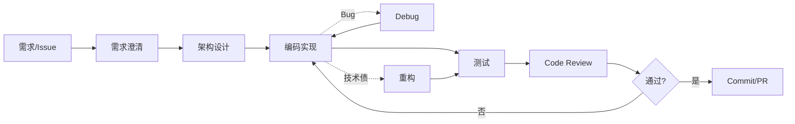

# 我的 AI 辅助开发工作流

> 版本：v0.2（2026-05-27）  
> 原则：AI 是协作者，不是替代者。每个环节都有人工校验点。  
> API：仅 DeepSeek → 见 `00_Roadmap/learning_constraints.md`

---

## 流程总览



---

## 各阶段 AI 介入点

| 阶段 | AI 做什么 | 我做什么（校验） | 模板 |
|---|---|---|---|
| 需求澄清 | 生成结构化需求、边界条件、验收标准 | 确认业务逻辑、删除错误假设 | `prompts/requirements.md` |
| 架构设计 | 生成方案对比、模块划分、接口草案 | 评估与现有系统的兼容性 | `prompts/architecture.md` |
| 编码 | 生成代码、补全、解释 | Review 每一行，跑测试 | Cursor Agent |
| 测试 | 生成单元测试、边界用例 | 确认覆盖率和断言正确性 | Cursor Agent |
| Code Review | 初筛 diff、找 bug/风格问题 | 最终判断，不盲信 AI | `prompts/code_review.md` |
| Debug | 分析错误栈、提修复方案 | 验证根因，不只看表面 | `prompts/debug.md` |
| 重构 | 生成重构计划、批量改名 | 小步提交，每步跑测试 | `prompts/refactor.md` |

---

## Git + AI 工作流

```bash
# 1. 基于 issue 生成计划
# 使用 prompts/requirements.md

# 2. 开发完成后，AI 审查 diff（DeepSeek）
cd 01_AI_Dev_Workflow_Kit
cp .env.example .env   # 本地填入 DEEPSEEK_API_KEY，不进 git
python scripts/ai_commit_review.py --unstaged

# 3. 测试失败时，粘贴错误给 AI
# 使用 prompts/debug.md

# 4. 提交前自检清单
# - [ ] AI 生成的代码我逐行看过
# [ ] 测试全部通过
# - [ ] 没有提交 secrets / 调试代码
# - [ ] commit message 清晰
```

---

## 记录规范

每次使用 AI 辅助开发，在 `logs/` 目录创建记录：

```markdown
## 日期 / 任务

## 我自己原本会怎么做
## AI 帮我做了什么
## 哪些地方有效
## 哪些地方无效
## 我如何修正 AI 输出
## 可复用经验
```

同时在 `00_Learning_Logs/daily/` 的 Daily Log 中写一行摘要。

---

## 当前版本状态（v0.2）

- [x] `ai_commit_review.py` 已接入 DeepSeek API
- [x] Docker 运行支持
- [ ] Prompt 模板全部完成实战验证
- 真实使用记录：**1 / 5**（目标 >= 5）

---

## 下一步

1. 完成 5 个 Prompt 模板
2. 选一个小功能走完整闭环
3. 积累 5 条真实使用记录
4. 写阶段复盘
