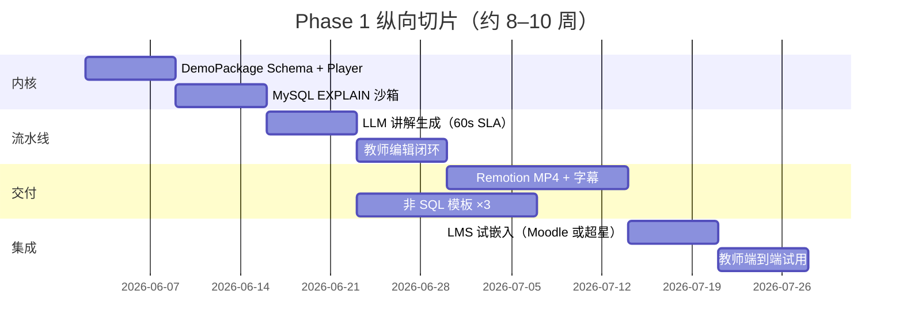

# DB Demo Studio — 数据库课程演示生产工具

> **完整学习项目**：从需求澄清 → 架构设计 → PoC → 分阶段实现，面向大学数据库课教师的可视化演示生产工具。

| 字段 | 值 |
|---|---|
| **项目代号** | `db_demo_video` / DB Demo Studio |
| **状态** | Phase 0 — 文档与架构已就绪，待 PoC |
| **代码根目录** | 本目录 `02_DB_Demo_Studio/` |

---

## 项目目标

为大学数据库课程教师提供**全课纲内容生产 + 三场景教学**工具：从课本知识点与 SQL 示例出发，经 **LLM 自动生成分步讲解与可视化初稿**，教师精修后产出**课堂可交互网页**与**带双语字幕 MP4**；执行语义以 MySQL/PostgreSQL 为参照；支持 LMS 嵌入与学生课后自学。

**双交付物（同源）：** 交互网页 + MP4（含字幕，至少中英双语）

**三场景：** 教师备课 · 课堂现场分步演示 · 学生课后只读自学

---

## 文档索引

| 文档 | 路径 | 说明 |
|---|---|---|
| **需求澄清** | [`00_Notes/requirements/db_demo_video_requirements.md`](../00_Notes/requirements/db_demo_video_requirements.md) | Q1–Q10 已确认；功能清单与验收标准 |
| **架构设计（canonical）** | [`docs/architecture.md`](./docs/architecture.md) | 方案 A/B 对比、模块划分、接口、分阶段实施 |
| **课纲—模板映射** | [`docs/curriculum-mapping.md`](./docs/curriculum-mapping.md) | 8 大类课纲节点与 Phase 1/2 实现顺序 |
| **架构文档跳转** | [`00_Notes/requirements/db_demo_video_architecture.md`](../00_Notes/requirements/db_demo_video_architecture.md) | 指向本目录 canonical 架构 |

---

## 与 Agent_System 仓库的关系

| 路径 | 关系 |
|---|---|
| `00_Notes/requirements/` | 需求与历史架构跳转；**不**放产品代码 |
| `01_AI_Dev_Workflow_Kit/` | 可复用 Prompt 模板、Docker、AI 工作流**经验**；**运行时零耦合** |
| `02_DB_Demo_Studio/` | **本产品**独立 monorepo 根目录（本文档所在） |

---

## 建议目录结构（Phase 1 落地时）

```
02_DB_Demo_Studio/
├── apps/
│   ├── web/          # React：备课 / 课堂 / 学生三模式
│   ├── api/          # Fastify：CRUD、生成编排、导出、LMS
│   └── renderer/     # Remotion：MP4 + 字幕导出
├── packages/
│   ├── demo-schema/  # 演示包 JSON Schema（单一真相源）
│   ├── viz-primitives/
│   ├── db-engine/
│   ├── llm-pipeline/
│   └── ...
├── infra/            # docker-compose、部署清单
└── docs/             # 架构与课纲映射（当前已有）
```

当前 Phase 0 仅包含 `docs/` 与占位目录；PoC 通过后初始化 monorepo 工具链（pnpm + Turborepo）。

---

## Phase 1 路线图



### Phase 1 交付清单

- [ ] **DemoPackage** 单一数据模型驱动网页 Player 与 MP4 导出
- [ ] LLM 讲解词 + 教师逐步编辑（文案与动画）
- [ ] SQL 模板 ≥5 类；非 SQL 模板 ≥3 类（ER、范式、事务示意）
- [ ] MySQL EXPLAIN 完整；PostgreSQL 至少部分对照
- [ ] 交互网页 + 带中英字幕 MP4（同源步骤一致）
- [ ] 备课 + 课堂 + 学生只读链接
- [ ] 1 种 LMS 试嵌入；API 用量可观测与失败降级
- [ ] 1 名真实教师 10 分钟端到端验收

### Phase 2 方向（概要）

全课纲 8 大类模板补齐、双引擎完整并排、多 LMS、双语 TTS、案例库版本化、校内私有化运维。详见 [`docs/architecture.md`](./docs/architecture.md) 实施步骤。

---

## 快速开始（PoC 阶段）

1. 阅读 [需求文档](../00_Notes/requirements/db_demo_video_requirements.md) 与 [架构设计](./docs/architecture.md)
2. 按架构文档 **PoC 顺序 #1**：手写 DemoPackage JSON → 网页 Player 逐步播放
3. 记录 PoC 日志于 `02_DB_Demo_Studio/logs/`（待创建）或 `00_Learning_Logs/`

---

## 变更记录

| 日期 | 变更 |
|---|---|
| 2026-06-01 | 初始化学习项目目录、架构 canonical、课纲映射初稿 |
