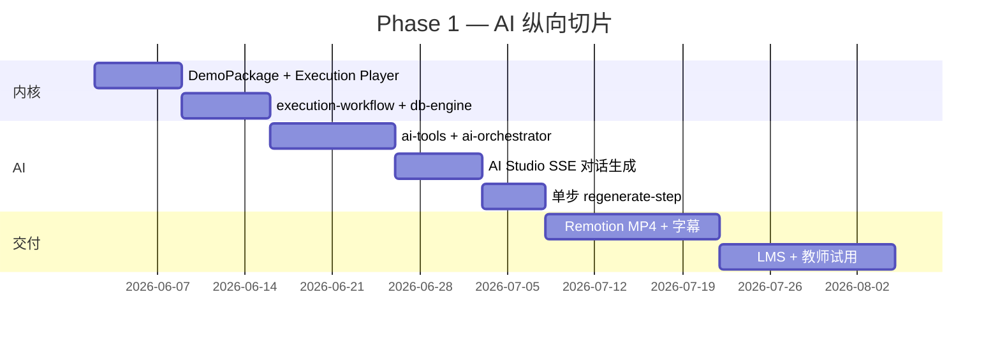

# DB Demo Studio — AI 原生数据库演示平台

> **完整学习项目**：需求澄清 → **AI 优先架构** → PoC → 分阶段实现。  
> 核心：**AI 交互式生成演示** + **执行演示工作流** → 同源导出交互网页与双语 MP4。

| 字段 | 值 |
|---|---|
| **技术栈** | React 19 + TS + Vite + Tailwind CSS（前端）· FastAPI + WebSocket + Redis + Docker（后端） |
| **状态** | Phase 1 — v5 全栈基线（教师工作台 + WS 对话 + 工具链） |
| **代码根目录** | 本目录 `02_DB_Demo_Studio/` |

---

## 项目目标

为大学数据库课教师提供 **AI 对话式演示生产工具**：用自然语言描述知识点或粘贴 SQL，**AI Agent** 结合 MySQL/PostgreSQL **EXPLAIN 真值**与课纲上下文，**流式生成**分步执行演示；教师可对话修改任一步；定稿后**同源发布**交互网页与带双语字幕 MP4。

### 两大核心能力

| 能力 | 说明 |
|---|---|
| **AI 交互式生成** | AI Studio 对话界面 — 流式预览、单步重写、Slash 快捷指令 |
| **执行演示工作流** | SQL/概念 → 标准阶段 DAG（解析→计划→执行→结果）— EXPLAIN grounding，防幻觉 |

**双交付物（同源）：** 交互网页 + MP4（含字幕，至少中英双语）

**三场景：** 教师备课（AI Studio）· 课堂分步演示（Execution Player）· 学生课后自学

---

## 文档索引

| 文档 | 路径 | 说明 |
|---|---|---|
| **需求澄清** | [`00_Notes/requirements/db_demo_video_requirements.md`](../00_Notes/requirements/db_demo_video_requirements.md) | Q1–Q10；含 AI 交互与执行工作流功能 |
| **架构设计 v2（AI 优先）** | [`docs/architecture.md`](./docs/architecture.md) | Agent + 执行工作流 + 方案 A/B |
| **AI 工作流详设** | [`docs/ai-workflow.md`](./docs/ai-workflow.md) | AI Studio、Agent、Tools、SSE 协议 |
| **课纲—模板映射** | [`docs/curriculum-mapping.md`](./docs/curriculum-mapping.md) | 8 大类与 workflowType 映射 |

---

## 与 Agent_System 仓库的关系

| 路径 | 关系 |
|---|---|
| `00_Notes/requirements/` | 需求与历史架构跳转；**不**放产品代码 |
| `01_AI_Dev_Workflow_Kit/` | 可复用 Prompt 模板、Docker、AI 工作流**经验**；**运行时零耦合** |
| `02_DB_Demo_Studio/` | **本产品**独立 monorepo 根目录（本文档所在） |

---

## 建议目录结构（当前实际状态）

```
02_DB_Demo_Studio/
├── apps/
│   ├── web/                        ✅ React 18 + TS + Vite + Tailwind（3 页面）
│   ├── api/                        ✅ FastAPI 后端（REST + WebSocket + SSE 兼容）
│   └── renderer/                   🔜 moviepy MP4 导出
├── packages/
│   ├── demo-schema/                ✅ Schema + 校验 + 6 步 JOIN 样例
│   ├── db-engine/                  ✅ Docker MySQL 8 + PG 16 沙箱
│   ├── execution-workflow/         ✅ SQL 解析 → 6 步 DAG 引擎
│   ├── ai-tools/                   ✅ 8 个 LLM 工具（DeepSeek 兼容）
│   ├── ai-orchestrator/            🔜 ReAct Agent Loop（W1 D5）
│   └── ...
├── infra/
└── docs/                           ✅ 架构 + AI 工作流 + 课纲映射
```

### W1-W2 PoC 进度（实际）

| PoC | 交付 | 状态 |
|---|---|---|
| **#1** | DemoPackage Schema + validate.py + 6 步 JOIN 样例 | ✅ |
| **#2** | ExecutionPlayer（React 组件 + 纯 HTML） | ✅ |
| **#3** | db-engine Docker 沙箱（MySQL 8 + PG 16） | ✅ |
| **#4** | execution-workflow SQL 解析引擎（6 步 DAG） | ✅ |
| **#5** | ai-tools 8 个 LLM 可调工具（含 DeepSeek SDK） | ✅ |
| **#6** | React 前端 + FastAPI 后端 + 教师工作台三栏 UI | ✅ |

> 下方 Gantt 为 **Phase 1 产品化纵向切片（约 2 周）**，当前 Step 1-3 已完成，Step 4 进行中。

---

## Phase 1 路线图



### Phase 1 交付清单

- [x] **Execution Workflow** — SQL 分步 DAG + EXPLAIN grounding ✅
- [x] **AI Studio** — 对话流式生成演示初稿（React + FastAPI WebSocket） ✅
- [ ] **单步 AI 重写** — regenerate-step，不整包重来 🔜
- [x] **DemoPackage** 驱动 Player（步骤一致） ✅
- [x] LLM 讲解 + 教师编辑；MySQL EXPLAIN；PG 部分对照 ✅
- [ ] 非 SQL 工作流 ×3（ER、范式、事务） 🔜
- [ ] 交互网页 + 中英字幕 MP4；LMS 试嵌入 🔜

### Phase 2 方向（概要）

全课纲 8 大类模板补齐、双引擎完整并排、多 LMS、双语 TTS、案例库版本化、校内私有化运维。详见 [`docs/architecture.md`](./docs/architecture.md) 实施步骤。

---

## 快速开始（PoC 阶段）

1. 阅读 [需求](../00_Notes/requirements/db_demo_video_requirements.md)、[架构 v2](./docs/architecture.md)、[AI 工作流](./docs/ai-workflow.md)
2. PoC **#1**：手写带 `workflowPhase` 的 DemoPackage → Execution Player 分步播放
3. PoC **#2**：`explain_mysql` 工具 → 工作流 IR → 至少 3 步 grounding
4. PoC **#3**：最小 AI Studio — 单轮对话 SSE 生成一步讲解词

---

## 变更记录

| 日期 | 变更 |
|---|---|
| 2026-06-02 | **v5 全栈**：React + FastAPI + WebSocket + Docker Compose + 教师工作台 |
| 2026-06-01 | 初始化学习项目目录、架构 canonical、课纲映射初稿 |
| 2026-06-01 | **v2 AI 优先**：architecture 重构、新增 ai-workflow.md |
