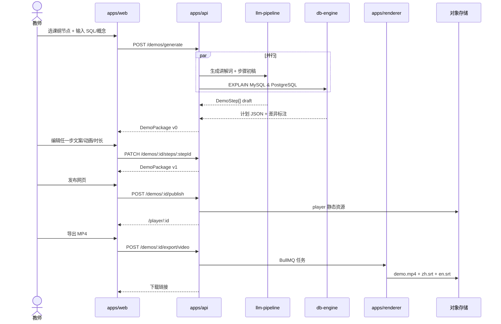

# DB Demo Studio — 架构设计

| 字段 | 值 |
|---|---|
| **日期** | 2026-06-01 |
| **状态** | 架构定稿，待 PoC 验证 |
| **项目代号** | db_demo_video |
| **需求来源** | [`00_Notes/requirements/db_demo_video_requirements.md`](../../00_Notes/requirements/db_demo_video_requirements.md) |
| **代码根目录** | `02_DB_Demo_Studio/` |

---

## 需求摘要

为大学数据库课程教师提供**全课纲可视化演示生产工具**：从课本知识点与 SQL 示例出发，经 **LLM 自动生成分步讲解与动画初稿**，教师精修每步文案与动画后，**同源发布**课堂可交互网页与**带中英双语字幕的 MP4**；SQL 执行语义对齐 **MySQL + PostgreSQL**；支持 **教师备课、课堂分步演示、学生课后自学** 三场景及 **Moodle / 超星 LMS 嵌入**。

**已确认决策（Q1–Q10）：** 双交付物 · 自动生成+教师可编辑 · LLM 讲解词 · 双引擎 · 全课纲 · 三场景 · 预算充足/付费 API · LMS · 真实教学产品 · 字幕双语。

---

## 现有系统上下文

- **技术栈：** TypeScript monorepo（pnpm + Turborepo）— React 18 + Vite 前端；Node.js + Fastify 后端；BullMQ + Redis 任务队列；PostgreSQL 16 业务库；MinIO/S3 对象存储；Remotion + ffmpeg 视频导出；LLM/TTS 付费 API；Docker 沙箱 MySQL 8 + PostgreSQL 16（EXPLAIN）；LTI 1.3（Moodle）+ iframe 深链接（超星）

- **相关模块：**
  - `02_DB_Demo_Studio/apps/web` — 备课 / 课堂 / 学生三模式前端
  - `02_DB_Demo_Studio/apps/api` — REST API、生成编排、导出、LMS、RBAC
  - `02_DB_Demo_Studio/apps/renderer` — Remotion MP4 + 字幕渲染
  - `02_DB_Demo_Studio/packages/demo-schema` — 演示包 JSON Schema（单一真相源）
  - `02_DB_Demo_Studio/packages/viz-primitives` — 共享可视化组件
  - `02_DB_Demo_Studio/packages/db-engine` — MySQL/PG EXPLAIN 沙箱
  - `02_DB_Demo_Studio/packages/sql-analyzer` — SQL 解析与步骤拆分
  - `02_DB_Demo_Studio/packages/llm-pipeline` — LLM 提示词与降级
  - `02_DB_Demo_Studio/packages/subtitle-kit` — 双语字幕时间轴
  - `02_DB_Demo_Studio/packages/lms-bridge` — LTI / 超星嵌入
  - `02_DB_Demo_Studio/packages/curriculum` — 课纲模板注册表
  - `00_Notes/requirements/db_demo_video_requirements.md` — 需求文档（只读引用）
  - `01_AI_Dev_Workflow_Kit/` — 工作流经验可复用，**运行时零耦合**

- **约束：**
  - 生成初稿 ≤ **60s**（含 LLM）；课堂步进切换 < **200ms**
  - **网页与 MP4 步骤、文案、时长必须一致**（单一 DemoPackage）
  - MySQL + PostgreSQL 真实 EXPLAIN；差异并排展示；非引擎行为标「教学简化」
  - 三场景 RBAC：学生只读，教师可编辑
  - 敏感 SQL 默认不出境；API Key 仅存服务端；付费 API 用量可审计
  - Phase 1 至少 **1 种 LMS** 试嵌入；字幕级中英双语
  - **YAGNI：** Phase 1 不做全校 SSO、LMS 成绩簿、内核级 DB 仿真、商业剪辑台

---

## 1. 方案 A（推荐）— TypeScript Monorepo + DemoPackage 单一真相源

### 模块划分

```text
02_DB_Demo_Studio/
├── apps/
│   ├── web/                 # React：prep / live / study / editor
│   ├── api/                 # Fastify：routes + BullMQ workers
│   └── renderer/            # Remotion compositions + render-cli
├── packages/
│   ├── demo-schema/         # Zod Schema + 版本迁移 + 导出校验
│   ├── viz-primitives/      # PlanTree, ERDiagram, BPlusTree, TransactionTimeline
│   ├── db-engine/           # MySQL/PG 沙箱 EXPLAIN → 统一 IR
│   ├── sql-analyzer/        # 解析、错误定位、步骤候选
│   ├── llm-pipeline/        # 课纲-aware 提示词、结构化 JSON 输出
│   ├── subtitle-kit/        # 中英 SRT/VTT、时间轴对齐校验
│   ├── lms-bridge/          # LTI 1.3 + 超星 embed
│   └── curriculum/          # 8 大类课纲模板 + Phase 标记
└── infra/
    └── docker-compose.yml   # api + web + pg + redis + minio + mysql + pg-sandbox
```

| 模块 | 职责 |
|---|---|
| **demo-schema** | 定义 `DemoPackage` / `DemoStep`；网页 Player 与 Remotion 的唯一输入 |
| **viz-primitives** | React 可视化原语；Player 与 Renderer **共用**，保证画面对齐 |
| **db-engine** | Docker 内只读 MySQL/PG；`EXPLAIN FORMAT=JSON`；归一化 + diff |
| **llm-pipeline** | 输入课纲节点 + SQL → 结构化步骤 + 中英讲解词；失败降级手写 |
| **api** | 编排：生成 → 编辑 → 发布 → 导出 → LMS；异步任务入 BullMQ |
| **web** | 三场景 UX；步骤编辑器；导出面板；课堂快捷键（空格/←/→） |
| **renderer** | 读 DemoPackage 时间轴 → MP4 + 字幕文件 |

### 核心接口定义

```typescript
// packages/demo-schema — 单一真相源
interface DemoPackage {
  id: string;
  curriculumNodeId: string;
  templateType:
    | 'sql-explain'
    | 'er-model'
    | 'normalization'
    | 'transaction'
    | 'bplus-tree'
    | 'storage-recovery'
    | 'concept-generic';
  title: { zh: string; en: string };
  steps: DemoStep[];
  engineCompare?: {
    mysql?: ExplainSnapshot;
    postgres?: ExplainSnapshot;
    simplificationNotes?: string[];
  };
  metadata: {
    aiDraftVersion?: string;
    teacherVersion: number;
    publishedAt?: string;
  };
  playback: {
    defaultStepDurationMs: number;
    subtitles: SubtitleTrack[];
  };
}

interface DemoStep {
  id: string;
  order: number;
  narration: { zh: string; en: string; source: 'ai' | 'teacher' };
  visuals: VisualSpec; // 引用 viz-primitives 类型
  timing: { durationMs: number; pauseAfterMs?: number };
}
```

```typescript
// apps/api — REST 核心端点（命名：kebab-case 路径 + camelCase JSON）
POST   /demos/generate          // body: { curriculumNodeId, sql?, conceptNotes? }
PATCH  /demos/:id/steps/:stepId // 教师编辑单步
POST   /demos/:id/publish       // → { playerUrl }
POST   /demos/:id/export/video  // 异步 → { jobId } → { mp4Url, subtitles[] }
GET    /demos/:id               // 学生只读 / 教师编辑
POST   /lms/launch-config       // → { ltiUrl | embedUrl }
GET    /jobs/:id                // 生成/渲染任务状态
```

```typescript
// packages/db-engine
interface DbEngineService {
  explainMySQL(sql: string): Promise<ExplainSnapshot>;
  explainPostgres(sql: string): Promise<ExplainSnapshot>;
  diffPlans(mysql: ExplainSnapshot, pg: ExplainSnapshot): EngineDiff;
}

// packages/llm-pipeline
interface LlmPipeline {
  generateSteps(input: GenerateInput): Promise<DemoStep[]>;
  translateNarration(zh: string): Promise<string>; // 英译，可选
}
```

### 数据流



**关键原则：** 网页 Player 与 Remotion **读取同一份 DemoPackage**，共用 `viz-primitives`，导出前运行 schema 一致性校验。

### 优点 / 缺点

| 优点 | 缺点 |
|---|---|
| 网页与 MP4 **天然同源**，满足 Q1 双交付验收 | Monorepo 初期搭建成本（pnpm + Turborepo） |
| TS 全栈，Player 与 Remotion **共享 React 组件** | Remotion 渲染耗资源，需异步队列 |
| 模块边界清晰，Phase 1 可纵向切片交付 | MySQL/PG Docker 沙箱增加运维复杂度 |
| LLM / EXPLAIN / 渲染均可独立降级 | LTI 1.3 集成有一定学习曲线 |
| 与 `01_AI_Dev_Workflow_Kit` **零耦合**，独立演进 | — |

---

## 2. 方案 B（备选）— Python 后端 + Puppeteer 录屏 + 多仓库

### 模块划分

```text
db-demo-web/          # React 前端（独立仓库）
db-demo-api/          # Python FastAPI：CRUD + LLM（LangChain）+ 任务
db-demo-worker/       # Celery：EXPLAIN 子进程 + Puppeteer 录屏
db-demo-schema/       # JSON Schema（pip package，版本独立发布）
```

| 模块 | 职责 |
|---|---|
| **FastAPI** | REST + Celery 任务；sqlparse + psycopg2/mysql-connector EXPLAIN |
| **LangChain** | LLM 编排、课纲 RAG（可选）、结构化输出 |
| **Puppeteer Worker** | 打开 Player URL → 逐步录屏 → ffmpeg 合并 + 字幕后期对齐 |
| **React Web** | 同方案 A 三场景 UX |

### 核心接口定义

```python
# db-demo-api/schemas/demo.py
class DemoPackage(BaseModel):
    id: str
    curriculum_node_id: str
    template_type: str
    steps: list[DemoStep]
    engine_compare: EngineCompare | None = None

# FastAPI routes
POST /api/v1/demos/generate
PATCH /api/v1/demos/{demo_id}/steps/{step_id}
POST /api/v1/demos/{demo_id}/export/video  # → Celery task → Puppeteer
```

```python
# db-demo-worker/tasks.py
@celery.task
def render_video(demo_id: str) -> str:
    """Puppeteer 打开 player，按步骤录屏，ffmpeg 烧字幕"""
    ...
```

### 数据流

```text
教师输入 → FastAPI → LangChain 生成步骤 + 子进程 EXPLAIN
         → 存入 PostgreSQL
         → 教师编辑 → 发布 Player URL
         → Celery 触发 Puppeteer 录屏 → ffmpeg 后期贴字幕 → S3
```

网页与视频**不共享渲染内核**：视频是「录出来的」，不是「渲染出来的」。

### 优点 / 缺点

| 优点 | 缺点 |
|---|---|
| Python AI 生态（LangChain）更丰富 | **网页与 MP4 易漂移**（字体/GPU/分辨率/步进时机） |
| FastAPI 开发速度快 | 三仓库版本对齐成本高 |
| Puppeteer PoC **极快**（1–2 天可出 demo） | 字幕时间轴需 ffmpeg 后期对齐，**双语同步难** |
| EXPLAIN 用 psycopg2 很成熟 | Remotion 级确定性帧质量达不到 |
| 团队若 Python 为主，上手快 | 与 TS 前端维护两套类型定义 |

---

## 3. 方案对比表

| 维度 | **方案 A（Monorepo + Remotion）** | **方案 B（Python + Puppeteer）** |
|---|---|---|
| **复杂度** | 中 — 单仓 + 共享包 | 中高 — 三仓 + 跨语言类型 |
| **可扩展性** | **高** — 加课纲模板 = 加 viz-primitives | 中 — 录屏方案难扩展非 Web 动画 |
| **维护成本** | **低** — 单 PR 改 schema/UI/渲染 | 高 — 三仓同步 + 字幕对齐脚本 |
| **双交付一致性** | **高** — 同源 DemoPackage + 共享组件 | 低 — 录屏依赖运行时环境 |
| **LLM 集成** | 够用（openai SDK / 国产 API） | **强**（LangChain 生态） |
| **MP4 质量** | **高** — 矢量、确定性帧 | 中 — 依赖录屏环境 |
| **双语字幕** | **原生时间轴** | 需后期 ffmpeg，易不同步 |
| **LMS 集成** | 同等（LTI 语言无关） | 同等 |
| **Phase 1 速度** | 中 — 2 周出 Player PoC | **快** — 3 天出录屏 PoC |
| **生产可用性** | **适合 Q9 真实教学产品** | 适合早期 demo，难达验收 |
| **风险** | Remotion 学习曲线 | **视频漂移**（最大风险） |

---

## 4. 推荐方案及理由

**推荐方案 A：TypeScript Monorepo + DemoPackage 单一真相源 + Remotion 渲染。**

| 理由 | 对应需求 |
|---|---|
| Q1 要求 MP4 **与** 交互网页步骤一致 | 只有同源 Schema + 共享 viz 组件能可靠满足 |
| Q2/Q3 教师编辑后双出口同步 | 改 DemoPackage 一次，Player 与 Renderer 同读 |
| Q4 双引擎 EXPLAIN | `db-engine` 包独立，与渲染栈无关 |
| Q9 真实教学产品 | 需可维护、可版本化、可重复导出 |
| Q10 双语字幕 | Remotion 时间轴原生对齐，优于 ffmpeg 后期 |
| 与现有仓库兼容 | 新建 `02_DB_Demo_Studio/`，不改动 `01_*` |

**方案 B 的适用场景（YAGNI 保留）：** 仅作 **Phase 0 极早 demo**（3 天内验证「教师是否愿意逐步看 SQL」），**不进入 Phase 1 生产路径**。

---

## 5. 实施步骤（分阶段，每阶段可独立交付）

### Phase 0 — 文档与骨架（当前）

| 交付物 | 可独立验收 |
|---|---|
| 需求澄清 Q1–Q10 | ✅ 已完成 |
| 架构文档（本文） | ✅ |
| `02_DB_Demo_Studio/` 目录 + README | ✅ |
| 课纲—模板映射表 | [`curriculum-mapping.md`](./curriculum-mapping.md) |

### Phase 1 — 纵向切片（可进课堂试用，约 8–10 周）

| 步骤 | 交付物 | 独立验收 |
|:---:|---|---|
| **1** | `demo-schema` + 手写 JSON + 网页 Player 逐步播放 | 浏览器 ←/→/空格 控制 3 步 |
| **2** | `db-engine` MySQL EXPLAIN 沙箱 → PlanTree 渲染 | Docker 内 EXPLAIN JSON → 可视化 |
| **3** | `llm-pipeline` 课纲 + SQL → ≥3 步 + 讲解词（60s） | API 返回结构化 DemoPackage draft |
| **4** | 教师编辑闭环（PATCH step） | 改文案后 Player 即时更新 |
| **5** | `renderer` Remotion → MP4 + zh/en SRT | 与 Player 画面对齐抽查 |
| **6** | 非 SQL 模板 ×3（ER、范式、事务） | 各 1 条端到端 |
| **7** | `lms-bridge` Moodle LTI **或** 超星 iframe | 课程页打开只读演示 |
| **8** | 三场景 UX + 学生只读链接 | RBAC 验证 |
| **9** | 1 名教师 10 分钟端到端试用 | 复现需求 §6 验收标准 |

**Phase 1 刻意不做（YAGNI）：** 全校 SSO、LMS 成绩簿、双 TTS 音轨、全课纲 100% 覆盖、K8s 生产部署。

### Phase 2 — 教学产品完善

| 增量 | 目标 |
|---|---|
| 课纲 8 大类模板 100% | B+ 树、存储恢复、锁深度动画 |
| 双引擎完整 | MySQL **与** PG 并排/切换全可用 |
| 双语 TTS + 字幕编辑器 | 导出格式完备 |
| 多 LMS | Moodle + 超星双验 |
| 案例库版本化 | 跨学期复用 |
| 校内私有化 | K8s + 备份 + 审计 |

---

## 6. 风险与缓解措施

| 风险 | 影响 | 缓解 |
|---|---|---|
| LLM 讲解词不准确 | 教学误导 | 教师必可编辑；发布前校对提示；AI/定稿版本对比 |
| 网页与 MP4 不同步 | 验收失败 | 单一 DemoPackage；共享 viz-primitives；导出前自动 diff |
| Remotion 渲染慢/失败 | 体验差 | 异步队列；720p 默认；**网页发布不依赖 MP4** |
| MySQL/PG 计划差异大 | 学生困惑 | 并排 + 文案解释；标注「教学简化」 |
| LMS CSP / iframe 拒绝 | 无法嵌入 | 独立分享链接 fallback；域名白名单文档 |
| 付费 API 限流/故障 | 生成中断 | 重试 + 队列；降级纯手写文案 |
| 敏感 SQL 外泄 | 合规 | 默认禁止外呼；校内 API 端点；审计日志 |
| 范围膨胀（全课纲一次做完） | 延期 | Phase 1 纵向切片；课纲映射表排优先级 |
| 沙箱 SQL 注入 | 安全 | 只读账号；白名单 SELECT/EXPLAIN；5s 超时 kill |

---

## 附录：与 workflow kit 的复用关系

| 可复用 | 不可复用 |
|---|---|
| `prompts/requirements.md` / `architecture.md` 模板流程 | `ai_commit_review.py` 运行时 |
| Docker Compose 经验 | Workflow Kit 的 LLM 配置 |
| Daily Log / 学习记录习惯 | — |

---

## 文档变更记录

| 日期 | 变更 |
|---|---|
| 2026-06-01 | 初稿：按 architecture 模板输出方案 A/B、对比、实施步骤、风险 |
