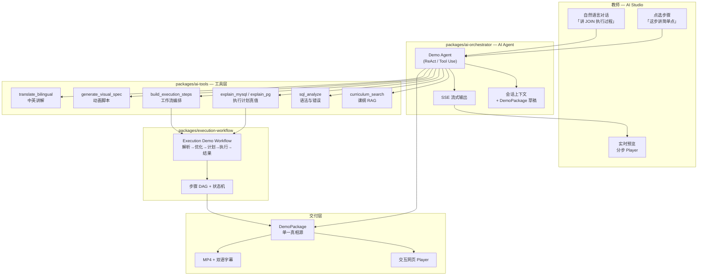
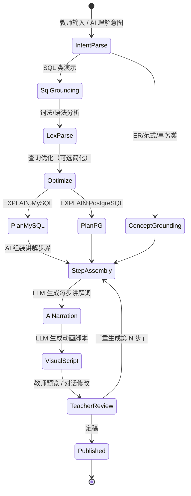
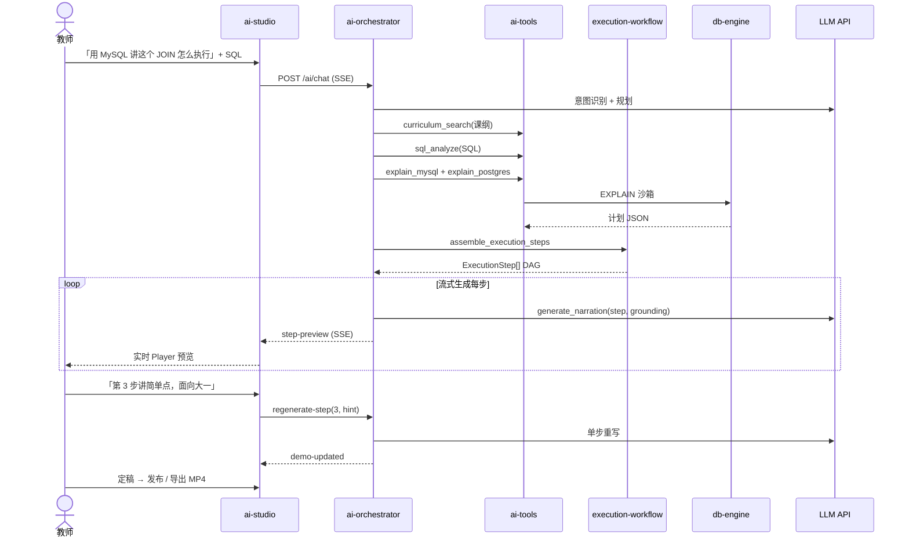

# DB Demo Studio — 架构设计（AI 优先）

| 字段 | 值 |
|---|---|
| **日期** | 2026-06-01 |
| **版本** | v2 — AI 交互生成 + 执行演示工作流 |
| **状态** | 架构定稿，待 PoC 验证 |
| **项目代号** | db_demo_video |
| **需求来源** | [`00_Notes/requirements/db_demo_video_requirements.md`](../../00_Notes/requirements/db_demo_video_requirements.md) |
| **AI 工作流详设** | [`ai-workflow.md`](./ai-workflow.md) |
| **代码根目录** | `02_DB_Demo_Studio/` |

---

## 产品定位（AI 优先）

**DB Demo Studio 是一个 AI 原生的数据库教学演示平台**——教师用自然语言与 AI 对话，交互式生成「分步执行演示 + 讲解词 + 动画脚本」，经人机协作定稿后，**同源导出**交互网页与带双语字幕 MP4。

| 传统工具 | 本产品（AI 优先） |
|---|---|
| 手工做 PPT / 录屏 | **对话式生成**演示初稿，流式可见 |
| 静态视频 | **可交互分步执行** + AI 可随时「重讲这一步」 |
| 模板填空 | **AI Agent + 工具调用**（EXPLAIN、课纲 RAG、SQL 分析） grounding |
| 一次性生成 | **迭代工作流**：生成 → 预览 → 修改 → 再生成单步 |

**两大 AI 核心能力：**

1. **AI 交互式生成演示** — 教师与 AI Copilot 对话，实时产出/修改 DemoPackage
2. **AI 驱动的执行演示工作流** — SQL/概念 → 分步执行逻辑 → 可视化 + 讲解，全程可追踪

---

## 需求摘要

为大学数据库课教师提供 **AI 交互式演示生产 + 执行过程可视化** 工具：自然语言描述课本知识点或粘贴 SQL，AI 结合 **MySQL/PostgreSQL EXPLAIN 真值** 与课纲上下文，**流式生成**分步演示初稿；教师可在对话中或编辑器里精修任一步；定稿后发布交互网页并导出带中英字幕 MP4；支持备课、课堂、自学三场景及 LMS 嵌入。

**已确认决策（Q1–Q10）：** 双交付 · AI 生成+教师可编辑 · LLM 讲解 · 双引擎 · 全课纲 · 三场景 · 付费 API · LMS · 真实教学产品 · 字幕双语。

---

## 现有系统上下文

- **技术栈：**
  - **AI 层：** **DeepSeek API**（OpenAI-compatible SDK；本仓库统一 Provider，见 [`learning_constraints.md`](../../00_Roadmap/learning_constraints.md)）+ **Agent 编排**（Tool Calling）+ **SSE 流式输出** + Prompt Registry
  - **执行 grounding：** Docker 沙箱 MySQL 8 + PostgreSQL 16（`EXPLAIN`）+ `node-sql-parser`
  - **应用层：** TypeScript monorepo — React 18 + Vite（**AI Studio** 对话 UI）；Fastify API；BullMQ + Redis
  - **渲染层：** Remotion + ffmpeg（MP4 + 字幕）；`viz-primitives` 与 Player 共用
  - **数据层：** PostgreSQL 16 + MinIO/S3 + 向量库（课纲/教材 RAG，Phase 1 可选简化）

- **相关模块：**
  - `apps/web/src/features/ai-studio/` — **AI 对话式生成界面**（核心 UX）
  - `apps/web/src/features/execution-player/` — 分步执行演示播放器
  - `packages/ai-orchestrator/` — **Agent 编排、多轮对话、工具调度**
  - `packages/ai-tools/` — LLM 可调工具：EXPLAIN、SQL 分析、课纲检索、步骤校验
  - `packages/execution-workflow/` — **执行演示工作流引擎**（状态机 + 步骤 DAG）
  - `packages/llm-pipeline/` — 提示词、结构化输出 Schema、降级策略
  - `packages/demo-schema/` — DemoPackage 单一真相源
  - `packages/db-engine/` — MySQL/PG 沙箱
  - `packages/viz-primitives/` — 可视化组件
  - `packages/prompt-registry/` — 版本化 Prompt（讲解/分步/动画/双语）
  - 详见 [`ai-workflow.md`](./ai-workflow.md)

- **约束：**
  - AI 首屏响应（流式第一 token）≤ **3s**；完整初稿 ≤ **60s**
  - 执行演示每步须可 **grounding** 到 EXPLAIN 或课纲模板（禁止纯幻觉步骤）
  - 教师可随时 **「只重生成当前步」** 而不整包重来
  - 网页与 MP4 步骤一致；引擎差异标「教学简化」
  - LLM 调用可审计；敏感 SQL 默认不出境
  - **LLM 仅 DeepSeek**；禁止 Phase 1 引入多 Provider 切换
  - SQL 类演示默认 **双引擎 EXPLAIN**（MySQL + PostgreSQL）；单引擎失败须显式降级标注

---

## AI 核心架构总览



---

## 执行演示工作流（Execution Demo Workflow）

SQL 类演示的核心不是「一次性生成视频」，而是 **可解释、可逐步推进的执行工作流**：



| 工作流阶段 | 执行者 | 输出 | AI 角色 |
|---|---|---|---|
| 意图理解 | Agent | `DemoIntent` | 解析教师自然语言 + 课纲节点 |
| SQL Grounding | `ai-tools` + `db-engine` | `ExplainSnapshot` ×2 | **禁止幻觉**：步骤必须引用 EXPLAIN 节点 |
| 步骤拆分 | `execution-workflow` | `ExecutionStep[]` | AI 建议顺序；引擎 IR 约束结构 |
| 讲解生成 | `llm-pipeline` | `narration.zh/en` | 逐步流式生成，可单步重写 |
| 动画脚本 | `llm-pipeline` | `VisualSpec` | 映射到 `viz-primitives` 类型 |
| 人机定稿 | `ai-studio` UI | `DemoPackage` vN | 对话式修改或表单编辑 |

---

## 1. 方案 A（推荐）— AI Agent + 执行工作流 + DemoPackage 同源渲染

### 模块划分

```text
02_DB_Demo_Studio/
├── apps/
│   ├── web/
│   │   └── src/features/
│   │       ├── ai-studio/          ★ AI 对话式生成（主入口）
│   │       ├── execution-player/   ★ 分步执行演示播放器
│   │       ├── step-editor/        步骤精修（表单 + 「Ask AI」）
│   │       └── export-panel/       发布网页 / 导出 MP4
│   ├── api/
│   │   └── src/
│   │       ├── routes/ai/          POST /ai/chat, /ai/regenerate-step (SSE)
│   │       ├── routes/workflows/   POST /workflows/execution/run
│   │       └── workers/            ai-generation, explain, render
│   └── renderer/
├── packages/
│   ├── ai-orchestrator/            ★ Agent 编排、会话、Tool Calling
│   ├── ai-tools/                   ★ LLM 工具：EXPLAIN、课纲、SQL、步骤
│   ├── execution-workflow/         ★ 执行演示状态机 + 步骤 DAG
│   ├── llm-pipeline/               提示词、结构化 JSON、降级
│   ├── prompt-registry/            Prompt 版本管理
│   ├── demo-schema/                DemoPackage Schema
│   ├── db-engine/                  MySQL/PG 沙箱
│   ├── sql-analyzer/
│   ├── viz-primitives/
│   ├── subtitle-kit/
│   ├── lms-bridge/
│   └── curriculum/
└── infra/
```

| 模块 | 职责 | AI 相关 |
|---|---|---|
| **ai-studio** | 对话 UI、流式预览、快捷指令（「简化」「加一步 EXPLAIN」） | **核心入口** |
| **ai-orchestrator** | 多轮 Agent；维护 `AiSession` + `DemoPackage` 草稿 | **大脑** |
| **ai-tools** | 注册 LLM 可调用工具；返回 grounding 数据 | **手与眼** |
| **execution-workflow** | SQL/概念 → 标准步骤 DAG；校验 EXPLAIN 覆盖 | **执行演示引擎** |
| **llm-pipeline** | 结构化输出、单步重写、双语、失败降级 | **文案与脚本** |
| **execution-player** | 按工作流步骤播放；高亮当前 EXPLAIN 节点 | **课堂核心 UX** |
| **demo-schema** | 单一真相源；含 `workflowTrace` 字段 | 可追溯 AI 生成链 |
| **renderer** | DemoPackage → MP4（步骤与 Player 一致） | 导出 |

### 核心接口定义

```typescript
// packages/demo-schema — 扩展 AI 与工作流追溯
interface DemoPackage {
  id: string;
  curriculumNodeId: string;
  templateType: DemoTemplateType;
  title: { zh: string; en: string };
  steps: DemoStep[];
  workflowTrace?: {
    workflowId: string;
    workflowType: 'sql-execution' | 'concept-progression';
    aiSessionId: string;
    grounding: { mysql?: string; postgres?: string }; // EXPLAIN 快照 ID
  };
  engineCompare?: { mysql?: ExplainSnapshot; postgres?: ExplainSnapshot };
  metadata: {
    aiDraftVersion?: string;
    teacherVersion: number;
    lastAiAction?: 'full-generate' | 'regenerate-step' | 'teacher-edit';
  };
  playback: { defaultStepDurationMs: number; subtitles: SubtitleTrack[] };
}

interface DemoStep {
  id: string;
  order: number;
  workflowPhase?: 'lex' | 'parse' | 'optimize' | 'plan' | 'execute' | 'result' | 'concept';
  narration: { zh: string; en: string; source: 'ai' | 'teacher' };
  visuals: VisualSpec;
  groundingRef?: string; // 指向 EXPLAIN 节点或课纲锚点
  timing: { durationMs: number };
}
```

```typescript
// packages/ai-orchestrator — Agent 核心 API
interface AiOrchestrator {
  /** 流式对话：教师自然语言 → 增量更新 DemoPackage */
  chat(sessionId: string, message: string): AsyncIterable<AiStreamEvent>;

  /** 只重生成单步（不整包重来） */
  regenerateStep(sessionId: string, demoId: string, stepId: string, hint?: string): Promise<DemoStep>;

  /** 触发完整执行演示工作流 */
  runExecutionWorkflow(input: WorkflowInput): Promise<WorkflowResult>;
}

type AiStreamEvent =
  | { type: 'text-delta'; content: string }
  | { type: 'tool-call'; tool: string; args: unknown }
  | { type: 'step-preview'; step: DemoStep }
  | { type: 'workflow-phase'; phase: string; status: 'running' | 'done' }
  | { type: 'demo-updated'; demo: DemoPackage }
  | { type: 'error'; message: string };
```

```typescript
// packages/ai-tools — LLM Tool 定义（OpenAI function calling 兼容）
const AI_TOOLS = [
  'curriculum_search',      // 课纲 RAG：检索章节与示例
  'sql_analyze',            // 语法树 + 错误定位
  'explain_mysql',          // MySQL EXPLAIN JSON
  'explain_postgres',       // PostgreSQL EXPLAIN JSON
  'assemble_execution_steps', // execution-workflow 入口
  'generate_narration',     // 单步/多步讲解词
  'generate_visual_spec',   // 动画脚本 → VisualSpec
  'translate_bilingual',    // 中英互译
  'validate_demo_package',  // Schema + grounding 校验
] as const;
```

```typescript
// apps/api — REST + SSE
POST   /ai/sessions                    // 创建 AI 会话
POST   /ai/sessions/:id/chat           // SSE 流式对话（主交互）
POST   /ai/sessions/:id/regenerate-step // 单步 AI 重写
POST   /workflows/execution            // 触发执行演示工作流（可脱离对话直接调用）
GET    /demos/:id                      // 含 workflowTrace
POST   /demos/:id/publish
POST   /demos/:id/export/video         // 异步 MP4
```

### 数据流（AI 交互式生成）



### 优点 / 缺点

| 优点 | 缺点 |
|---|---|
| **AI 交互**是主路径，符合产品定位 | Agent + Tool 编排复杂度高 |
| EXPLAIN **grounding** 降低幻觉 | 需设计清晰的流式 UX 与错误恢复 |
| 单步重生成本低于整包 | Prompt 版本管理需 discipline |
| 执行工作流可独立测试 | Phase 1 需优先做 AI Studio PoC |
| 同源 DemoPackage → 网页 + MP4 | — |

---

## 2. 方案 B（备选）— 表单批量生成 + 后置 AI 润色

### 模块划分

```text
apps/web/form-wizard/     # 表单：选课纲 → 填 SQL → 点「生成」
packages/batch-generator/   # 一次性 LLM 调用 → DemoPackage
packages/db-engine/         # EXPLAIN（生成后附加，非 Agent 调度）
```

### 核心接口

```typescript
POST /demos/generate  // 单次请求，无 SSE，无对话
PATCH /demos/:id/steps/:stepId  // 仅表单编辑，无「Ask AI」
POST /demos/:id/polish  // 可选：整包 AI 润色讲解词
```

### 数据流

```text
表单提交 → 并行(LLM 一次性输出 + EXPLAIN) → DemoPackage → 手工编辑 → 导出
```

### 优点 / 缺点

| 优点 | 缺点 |
|---|---|
| 实现快（2–3 周 MVP） | **无 AI 交互**，不符合「对话式生成」定位 |
| LLM 调用次数少、成本低 | 改一步常需整包重生成 |
| 无 Agent 调试负担 | 执行工作流与 AI 解耦，步骤易幻觉 |
| — | 难以突出 AI 产品差异化 |

---

## 3. 方案对比表

| 维度 | **A：AI Agent + 执行工作流** | **B：表单批量 + 后置润色** |
|---|---|---|
| **AI 交互体验** | **强** — 对话、流式、单步重写 | 弱 — 一键生成 |
| **执行演示 fidelity** | **高** — Workflow + EXPLAIN grounding | 中 — EXPLAIN 可能未参与步骤拆分 |
| **复杂度** | 中高 | 低 |
| **可扩展性** | **高** — 加工具即可扩展课纲 | 低 |
| **维护成本** | 中 — Prompt/Tool 版本化 | 低 |
| **MP4/网页一致** | **高**（DemoPackage 同源） | 高 |
| **产品差异化** | **AI 原生教学演示平台** | 普通演示工具 |
| **Phase 1 推荐** | **✅ 推荐** | 仅作技术 Spike，不作主路径 |

---

## 4. 推荐方案及理由

**推荐方案 A：AI Agent + Execution Workflow + DemoPackage 同源渲染。**

| 理由 | 说明 |
|---|---|
| 用户明确要求 | **AI 交互式生成** + **执行演示工作流** 是核心功能，非附加 |
| 降低幻觉 | Agent 必须通过 `explain_*` 工具 grounding，工作流约束步骤结构 |
| 教师效率 | 对话改单步比重跑整包更符合备课习惯 |
| 双交付 | DemoPackage 仍驱动 Player + Remotion |
| 学习项目价值 | 覆盖 Agent、Tool Use、SSE、工作流引擎——可写入作品集 |

**方案 B** 仅用于 **1 周 Spike** 验证 EXPLAIN → PlanTree 可视化，**不**作为产品主架构。

---

## 5. 实施步骤（AI 优先，分阶段可交付）

### Phase 0 — 文档（当前）

- [x] 需求 Q1–Q10
- [x] 架构 v2（本文）+ [`ai-workflow.md`](./ai-workflow.md)

### Phase 1 — AI 纵向切片（约 8–10 周）

| 顺序 | 交付物 | 验收 |
|:---:|---|---|
| **1** | `demo-schema` + `execution-player` 手动 JSON 播放 | 分步展示 5 个 workflowPhase |
| **2** | `db-engine` + `execution-workflow`（SQL 路径） | EXPLAIN → 步骤 DAG |
| **3** | `ai-tools`（explain_* + assemble_steps） | 工具单测通过 |
| **4** | `ai-orchestrator` + **AI Studio** SSE 对话 | 对话生成 ≥3 步初稿 ≤60s |
| **5** | **单步 regenerate-step** | 「讲简单点」只改一步 |
| **6** | 教师定稿 + `renderer` MP4 + 字幕 | 与 Player 对齐 |
| **7** | 非 SQL 工作流 ×3（ER/范式/事务） | concept-progression 工作流 |
| **8** | LMS 试嵌入 + 三场景 UX | 同 v1 验收 |

**Phase 1 YAGNI：** 向量课纲 RAG 可先用静态 JSON；复杂 multi-agent；双 TTS 音轨。

### Phase 2 — AI 与产品深化

- 课纲向量 RAG + 教材 PDF 检索
- 学生端 **AI 问答**（基于已发布 DemoPackage grounding，可选）
- 双语 TTS；案例库 + Prompt A/B 测试
- 多 LMS；执行工作流可视化编辑器

---

## 6. 风险与缓解措施

| 风险 | 缓解 |
|---|---|
| LLM 步骤幻觉 | **强制** `explain_*` + `validate_demo_package` 工具；无 grounding 的步骤拒绝发布 |
| Agent 循环/超时 | 最大工具调用 10 次；60s 硬超时；降级为「仅 EXPLAIN + 模板步骤」 |
| 流式 UX 混乱 | 分阶段事件：`workflow-phase` → `step-preview` → `demo-updated` |
| AI 成本 | 单步 regenerate；缓存 EXPLAIN；会话级 token 预算 |
| 讲解不准确 | 教师必可编辑；`source: ai \| teacher` 标记；发布前校对提示 |
| 网页/MP4 不一致 | 同源 DemoPackage + 共享 viz |

---

## 附录

- AI 工作流详设：[`ai-workflow.md`](./ai-workflow.md)
- 课纲映射：[`curriculum-mapping.md`](./curriculum-mapping.md)
- 与 `01_AI_Dev_Workflow_Kit`：复用 Prompt/Agent **方法论**；运行时零耦合

---

## 文档变更记录

| 日期 | 变更 |
|---|---|
| 2026-06-01 | v1：方案 A/B 初稿 |
| 2026-06-01 | **v2：AI 优先** — Agent、执行工作流、AI Studio、ai-orchestrator/ai-tools 模块 |
